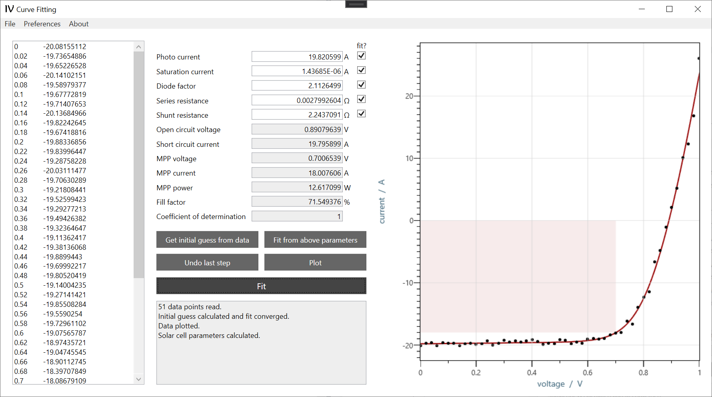

## Program for Fitting experimental IV curves by Single-Diode equivalent-Circuit Model

This script reads experimentally measured current-voltage data and fits a single-diode equivalent-circuit model to this data via the implicit diode equation.

  

