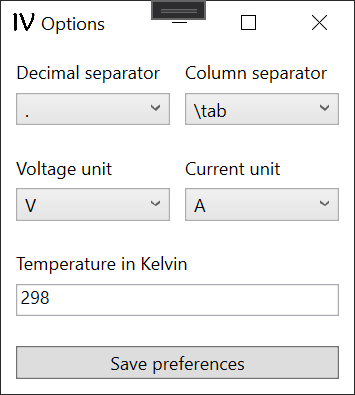

## Program for Fitting experimental IV curves by Single-Diode equivalent-Circuit Model

### Installing
You only need to download the executable file `./bin/Debug/SolarCell_DiodeModel_Fitting.exe` within this repository and run it on your windows computer.
The `.NET Framework 4.8` will be required to run it.

### Main Window
This easy-to-use script reads experimentally measured current-voltage data by copy and paste and fits a single-diode equivalent-circuit model to this data via the implicit diode equation.

  

<!-- https://latex.codecogs.com/eqneditor/editor.php -->
<!-- \color{DarkOrange}
I(V) = -I_\text{ph} + I_0 \cdot \left( \exp\left( \frac{q_e \cdot (V - I(V) \cdot R_\text{s})}{n \cdot k_\text{B} \cdot T} \right) -1 \right) + \frac{V- I(V) \cdot R_\text{s}}{R_\text{sh}}-->

The main window of the program is devided into three column. On the left, experimental data can be read from file or copy-pasted from clipboard.
In the middle, fitting parameters can be automatically fitted or manually manipulated. Moreover, basic solar cell parameters as Voc, jsc, and FF are displayed.
On the right side, the experimental data and the fit are plotted.  

### Option Window
There are several optional preferences for the IV curve. First of all, decimal and column spearators can be set. Furthermore, the units of voltage and currents can be choosen. Finally, the correct temperature has to be set.  

